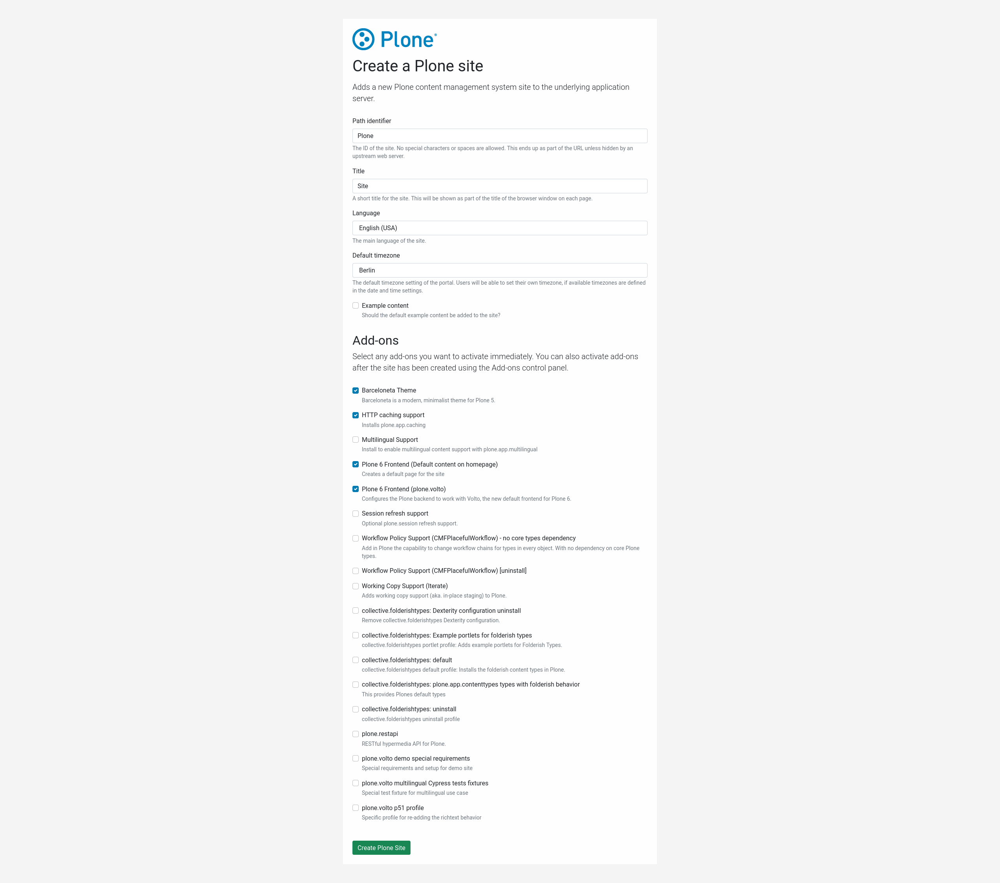

# Plone Deployment Training Example Repo

## Initial Setup

* Fork this repo into your Github account
* `git clone git@github.com:MYUSER/training-deploy-project.git`
* Open in your favorite text editor. ie: `cd training-deploy-project && code ./`
* Find all occurences of **DOCKER_HUB_USER_CHANGE_ME** and replace it with your Docker Hub user name

## Edit hosts

* Edit the ansible/hosts file to match your desired configuration.

## Install Prerequisites & Setup Development Environment

Before we get started, some programs will need to be installed first.  We can install these manually, or use the Ansible playbook to install them for us.

* Python >= 3.7
* Docker >= 20.10.9,
* Docker Compose >= 1.29.2
* Node 16, latest NPM and Yarn
* Vagrant and VirtualBox
* build-essential
* python3-venv, python3-pip, sshpass, libsdl-ttf2.0-0, latest kernel image, and latest kernel headers

### Install Python 3 virtual environment and Ansible

```shell
cd ansible
make clean
make setup
```

### Setup Development Environment

```cd ansible
make install
```

Choose menu option #1 and Ansible will fetch everything we need.

```shell
1 - Build Development Environment
```

## Setup backend

Create a Python virtual environment, install Plone 6.0.0a3 and one addon.

```shell
cd backend
make build
```

Run the Plone Backend instance
```shell
make start
```

In a browser, go to [http://localhost:8080/@@plone-addsite?site_id=Plone&advanced=1](http://localhost:8080/@@plone-addsite?site_id=Plone&advanced=1 and create a new site:



Stop the process

## Setup a new frontend project

On the root of this project

```shell
npm init yo @plone/volto
```

Answer the questions:
```
Project name (e.g. my-volto-project) frontend
Would you like to add addons? True
Addon name, plus extra loaders, like: volto-addon:loadExtra,loadAnotherExtra volto-slate:asDefault
Would you like to add another addon? false
```

Edit ```frontend/package.json``` and change ```"@plone/volto": "13.15.1",``` to ```"@plone/volto": "14.0.0-node16",```

And run ```cd frontend && yarn```

Start it with

```yarn start```

## Running everything with docker

```shell
make start-images
```

## Push your images to Docker Hub

```shell
make release-images
```

## Deploy Local Staging Server

Run the installer:

```shell
make install
```

Choose menu option #2 and Ansible will deploy your Docker image to a Vagrantbox on your local machine.

```shell
2 - Deploy Local Staging VM
```

## Deploy Remote Production Server

Run the installer:

```shell
make install
```

Choose menu option #3 and Ansible will deploy your Docker image to a remote machine.

```shell
3 - Deploy Remote Production VM
```
